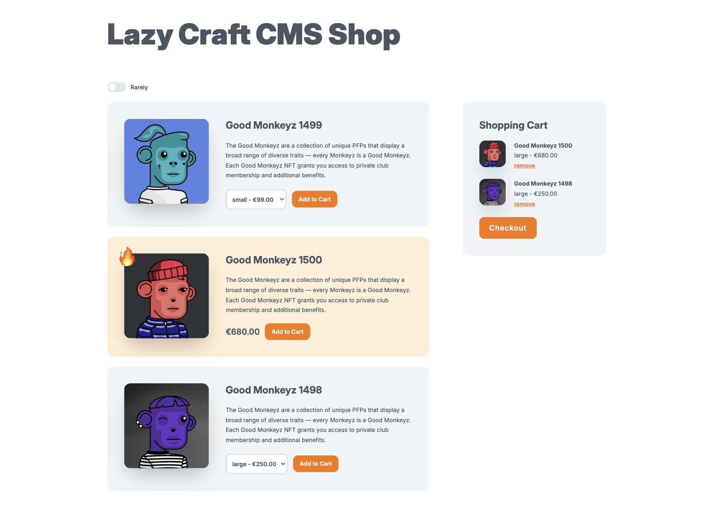
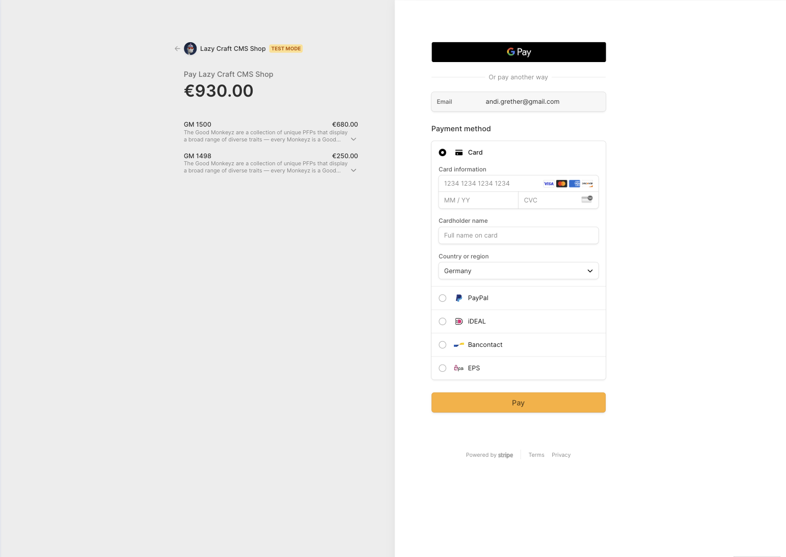

<p>

</p>

# Lazy Craft CMS 5 Shop

This boilerplate provides a lightweight and flexible e-commerce solution using Craft CMS and
the [Stripe Plugin](https://github.com/craftcms/stripe). It is designed for small businesses needing a simple, fast, and
effective shop setup.



**Note:** This is an **experimental** project and is still in development. It is intended to serve as a starting point,
but further refinement and features are required before being used in production.

## Features

- **Craft CMS 5**
- **Stripe Plugin** for secure payment processing.
- Simple product management with price variants.
- **Guest checkout** and **optional user login**. No registration process is required in the frontend – the user
  currently logged into the Craft CMS backend will be used for the checkout.
- Streamlined development stack: **Vite**, **Tailwind CSS**, **Sprig**.
- Minimal dependencies – no unnecessary plugins or libraries.

---

## Installation

### 1. Prerequisites

Ensure the following are installed:

- PHP 8.2+
- Composer 2+
- Node.js
- MySQL 8.0+
- Craft CMS CLI

### 2. Clone the Repository

```bash
git clone <repository-url> craft-shop
cd craft-shop
```

### 3. Install Dependencies

Run the following commands to install Composer and Node dependencies:

```bash
composer install
npm install
```

### 4. Configure Craft CMS

1. Copy the `.env.example` file:
   ```bash
   cp .env.example .env
   ```
2. Update the `.env` file with your database credentials and Stripe API keys:

- Set your **Stripe API keys** (both **live** and **test** modes) in the `.env` file:
  ```dotenv
  STRIPE_TEST_SECRET_KEY=your_test_secret_key
  STRIPE_TEST_PUBLIC_KEY=your_test_public_key
  STRIPE_LIVE_SECRET_KEY=your_live_secret_key
  STRIPE_LIVE_PUBLIC_KEY=your_live_public_key
  ```

3. After updating the `.env` file, Craft CMS will automatically load the Stripe API keys.

### 5. Set Up the Database

Run the following commands to set up the database:

```bash
php craft setup
php craft migrate/all
php craft project-config/apply
```

### 6. Start Development Server

```bash
npm run dev
```

---

## Stripe CLI for Local Development

The Stripe CLI is a useful tool for interacting with the Stripe API during local development. It allows you to listen
for Stripe events (like payment success or failure) and forward them to your local development server, which is critical
for webhook testing.

### 1. Install the Stripe CLI

Follow the official Stripe CLI installation instructions for your operating system from
the [Stripe CLI documentation](https://stripe.com/docs/stripe-cli#install).

### 2. Authenticate with Stripe

Once installed, authenticate the CLI with your Stripe account:

```bash
stripe login
```

This will open a browser window where you can log into your Stripe account.

### 3. Forward Webhooks to Local Development

Use the following command to forward webhook events from Stripe to your local development server:

```bash
stripe listen --forward-to localhost:8000
```

This command listens for Stripe events (such as successful payments) and forwards them to your local server. Ensure that
your Craft CMS is running on `localhost:8000` or adjust the port accordingly.

### 4. Testing Payments Locally

To simulate a payment event, you can trigger a test payment using the Stripe CLI:

```bash
stripe trigger payment_intent.succeeded
```

This will simulate a successful payment intent and trigger the corresponding webhook to your local server.

---

## Configuration

### Stripe Plugin

1. Navigate to **Settings > Plugins** in the Control Panel and enable the Stripe Plugin.
2. The **Stripe API keys** (live and test modes) should already be configured in your `.env` file. No need to manually
   enter them in the Control Panel.
3. Price variants for products are configured directly in Stripe, not within Craft CMS. Each product can have multiple
   price variants, and these are synced with Craft through the Stripe Plugin.

### Products

- Products are managed as entries in the `stripe -> products` section. These products will correspond to the price
  variants you've
  set up in Stripe.
- Each product entry can be linked to its Stripe variant ID.

---

## Development

### Build Scripts

- **Development:** `npm run dev`
- **Production Build:** `npm run build`

### Tech Stack

- **Frontend:** Tailwind CSS, Alpine.js, Sprig
- **Backend:** Craft CMS, Stripe Plugin, Craft Cookies Plugin

---

## License

This boilerplate is released under the MIT License. See the [LICENSE](LICENSE) file for details.

---

This version includes a note at the top indicating that this is an experimental project. Feel free to reach out if you
need further changes!
